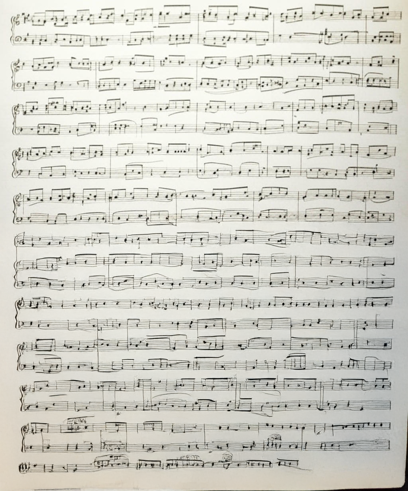
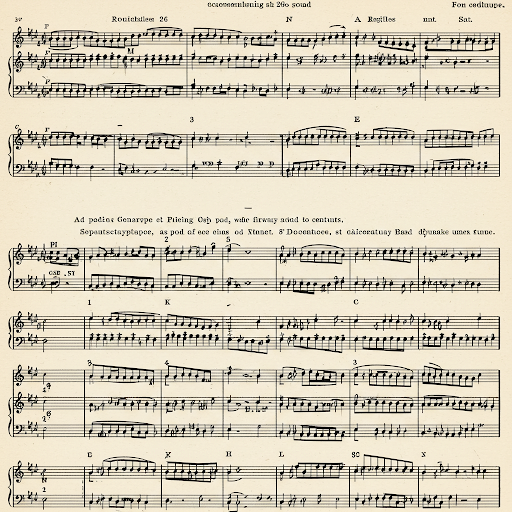

 *Statistically Realistic Music* is a collection of music scores for solo piano, generated by prompting various AI image generators on what they understand to be music notation.
The collection was originally a final project for an Art and Design course **ARTS 444: Generative AI in/as Art**, led by Prof. [Ben Grosser](https://bengrosser.com).
Recordings were made with the help of pianist Juan Camacho Castro.

The scores themselves used a handful of generative methods to produce results, including DALLE-3, ChatGPT 4o, Gemini, Grok 3, and Adobe Photoshop's generative fill/expand tools.
Each score has unique characteristics and styles given differences in input prompts, model training data and my intention.
Some scores are more clear and consistent, while other scores emulate hand-drawn and experimental characteristics.

While the concept of AI-generating music is a controversial topic, the goal of the collection is to study how generative models understand visual representations of music, while giving pianists free reign over score interpretation and performance.

## Recordings

Scores A1, A3 - https://www.youtube.com/watch?v=CjdTTMSXl0g

Score A2 - https://www.youtube.com/watch?v=i-loP8cCRe8

## Scores

    
    
    
    
    
    
    
    
    
    
    
    
    
    

